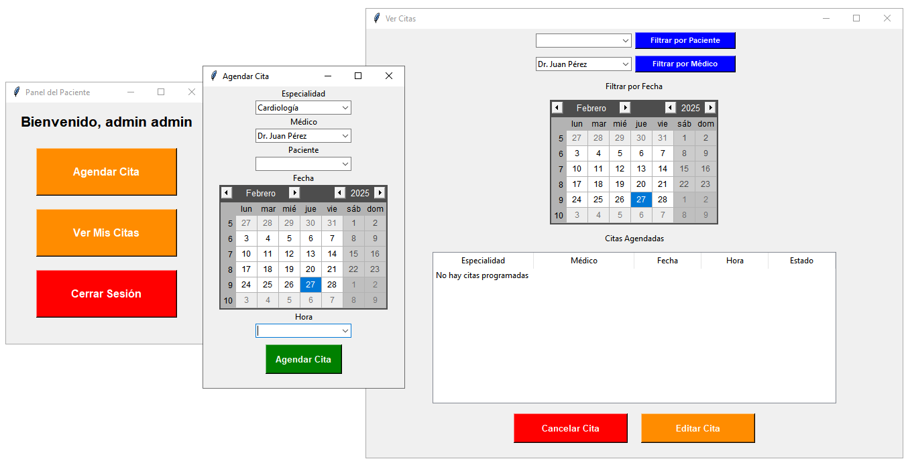
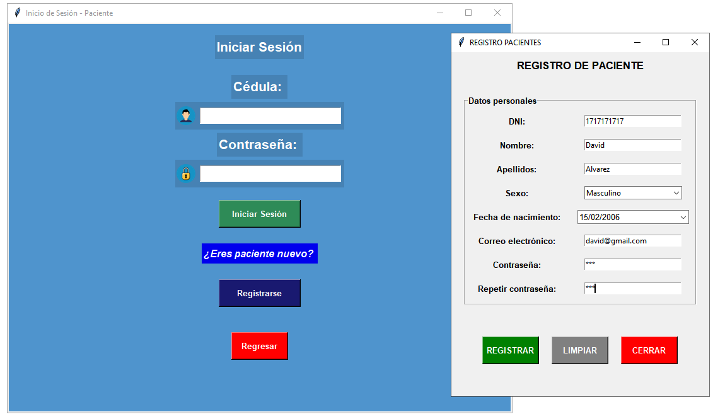

# Sistema de Gestión de Citas Médicas 📝
Esta aplicación es una interfaz completa para gestionar citas médicas utilizando Tkinter y SQLite. La aplicación cuenta con un sistema de login que permite a los usuarios autenticarse. Dependiendo del tipo de usuario, se habilitan diferentes funcionalidades, permite tanto a los administradores como a los pacientes interactuar con el sistema de citas.

# Características 🔧 
- **Sistema de Login:**
  - Los usuarios deben iniciar sesión para acceder a la aplicación. El sistema de login distingue entre pacientes y administradores, otorgando permisos según el rol.
- **Tecnologías Utilizadas:**
  - **Python**: Lenguaje de programación principal.
  - **Tkinter**: Biblioteca estándar de Python para la creación de interfaces gráficas.
  - **SQLite**: Base de datos ligera para almacenar la información de usuarios, médicos y citas.
- **Funcionalidades para Pacientes:**
  - Los usuarios pueden programar citas seleccionando la fecha, hora y el médico correspondiente.
  - Permite cancelar citas agendadas, liberando el horario para otros usuarios.
  - Los usuarios pueden revisar un listado de sus citas agendadas.
  - La aplicación muestra un calendario que marca las fechas de las citas.
- **Funcionalidades para Administradores:**
  - Los administradores pueden ver todas las citas y aplicar filtros por paciente, médico o fecha.
  - Permite modificar la fecha y hora de las citas, asegurando la correcta disponibilidad de horarios.
  - Además de la acción de cancelación, al hacerlo se actualiza la base de datos para dejar libre el horario correspondiente.
  - La aplicación muestra un calendario que marca las fechas de las citas.

## Vista Previa 👀

    
    
    

## Requisitos ✅

Para la versión en Python:
- Debes tener Python instalado si deseas ejecutar el código fuente.
- Python 3.8 o superior.
- Las siguientes dependencias de Python:
  - `tkinter` (para la interfaz gráfica).
  - `reportlab` (para generar PDFs).
  - `tkcalendar` (para el selector de fechas).
  - `webbrowser` (para abrir PDFs desde el navegador).

Para la versión ejecutable (`.exe`):
- No es necesario tener Python instalado.

## Instalación y Ejecución 🛠️

***Opción 1***: Ejecutar desde el código fuente
- Clona el **repositorio**.
- Instala las dependencias
- Abre el código **App_citas_medicas.py** en tu editor de texto o IDE favorito.
- Ejecuta el programa con **Python**.

***Opción 2***: Descargar el archivo ejecutable ⬇️
- Dirígete a la sección **dist** del proyecto.
- Descarga el archivo **App_citas_medicas.exe** disponible.
- Haz doble clic sobre el archivo **App_citas_medicas.exe** para iniciar la app.

## Contacto 📞
Si tienes preguntas o sugerencias, no dudes en contactar:

Autor: David Alvarez

Email: playdacid@gmail.com
